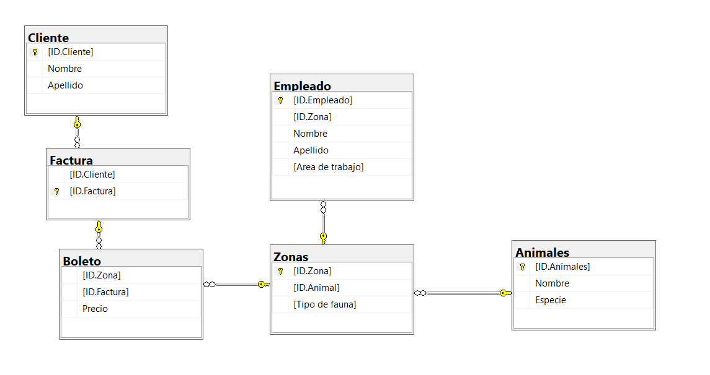

# Proyecto-final-BD-Progra

Presentación para los proyectos finales de Base de Datos y Progra 1
=======

Materia: Programacion 1 y base de Datos       Fecha: 14/12/24
Intengrantes del Grupo: Andres Mallea 
                        Mijael Callejas
Repositorio previo: https://github.com/Andress-Mallea/Proyecto-Zoologico
## El Problema:
El Problema el cual se nos es planteado nos pone en el papel de un ingeniero de software el cual es nuevo en una empresa en la cual se lee indica que debe modernizar el sistema de heredamiento de esta en base a la utilización de una base de datos relacional y una aplicación hecha en Python. Siendo que este programa debe ser capaz de integrarse a la infraestructura que ella tiene la compañía y abordar las diferentes complejidades que pueden ocurrir durante la migración de datos, pero igual que debe ser poder capaz de interactuar con los datos dentro de las bases de datos las cuales se manejan.
La primera premisa del problema nos plantea la creación de un programa hecho en Python el cual debe ser capaz de migrar las bases de datos de un manejador de las mismas tal como puede ser el SQL Server a otro manejador de bases de datos cómo puede ser MySQL
La segunda premisa nos plantea la creación de un programa de Python el cual por medio de una interfaz sea capaz de interactuar con las diferentes bases de datos dentro de nuestros programas de manejo de datos de manera tal de que desde esta interfaz se pueda añadir, borrar, e indicar que bases de datos migrar, etc.
Una vez sabiendo en que consiste el problema nos toca preguntarnos qué tipo de base de datos se planea desarrollar y para eso necesitamos saber ¿Que es una base de datos Relacional?
## ¿Que es una base de datos Relacional?
Una base de datos relacional es un tipo de base de datos que organiza y almacena información en tablas relacionadas entre sí. Estas tablas, también conocidas como “conjuntos de datos” o “entidades”, están compuestas por filas y columnas.
Cada fila representa una instancia única de un conjunto de datos, y cada columna define un atributo o característica de ese conjunto de datos. Las relaciones entre las tablas se establecen a través de claves primarias y claves foráneas, que permiten enlazar filas entre diferentes tablas.
Las bases de datos relacionales tienen las siguientes características:
1.	Tablas: La información se organiza en tablas, que tienen filas y columnas.
2.	Relaciones: Las tablas se relacionan entre sí a través de claves primarias y claves foráneas.
3.	Modelo relacional: La base de datos se basa en el modelo relacional, que describe cómo se organizan y relacionan los datos.
4.	Lenguaje de consulta: Se utiliza un lenguaje de consulta estructurado, como SQL (Structured Query Language), para interactuar con la base de datos y realizar operaciones de lectura, escritura y actualización.
Las bases de datos relacionales son ideales para aplicaciones que requieren:
•	Mantener relaciones entre diferentes conjuntos de datos.
•	Realizar consultas complejas y filtradas.
•	Garantizar la integridad y consistencia de los datos.
•	Soportar transacciones y operaciones de negocio críticas.
Ejemplos de bases de datos relacionales incluyen:
•	MySQL
•	PostgreSQL
•	Microsoft SQL Server
•	Oracle
•	IBM DB2
### Modelo de Base de datos relacional

=======
Además de esto también necesitamos saber ¿Qué es una aplicación?
## ¿Qué es una aplicación?
Una aplicación, comúnmente abreviada como “app”, es un programa de software diseñado para realizar una función determinada directamente para el usuario. Es un conjunto de pasos lógicos escritos en un lenguaje de programación que permite realizar tareas a un usuario, sin que este vea todo lo que está detrás, ya que su interacción con la aplicación se da a través de una interfaz visual.
Características
Las aplicaciones tienen las siguientes características:
•	Se instalan en el software del dispositivo (como un teléfono inteligente o una tableta) y se encuentran allí de forma permanente.
•	Requieren conexión a datos para su uso, dependiendo de la naturaleza de estas.
•	No desaparecen del dispositivo aún y cuando no tengas conexión a internet.
•	Pueden ser descargadas de forma gratuita o compradas en una tienda de aplicaciones (como App Store, Google Play, Microsoft Store, Amazon AppStore, Opera Mobile Store, entre otras).
## ¿Que es una interfaz?
Una interfaz (también conocida como “interfaz”) es la conexión física y funcional que se establece entre dos aparatos, dispositivos o sistemas que funcionan independientemente uno del otro. En otras palabras, es el mecanismo o herramienta que permite la comunicación entre dos entidades, como un ser humano y una computadora, o entre dos dispositivos electrónicos.
Características
La interfaz puede tener diferentes formas y modalidades, según el contexto en que se utilice. Algunas de sus características clave son:
•	Física: La interfaz puede ser un puerto, un conector, un cable o un dispositivo que permite la transferencia de señales entre los dos extremos.
•	Funcional: La interfaz define cómo se comunican los dos sistemas o dispositivos, estableciendo un conjunto de reglas y protocolos para la interacción.
•	Lógica: La interfaz puede ser lógica, es decir, se basa en la representación de objetos, iconos y elementos gráficos que simbolizan acciones o tareas que el usuario puede realizar.

## Estructura del repositorio:
Es repositorio el cual hemos utilizado para la elaboración de este programa está estructurado de la siguiente manera dentro del mismo se puede encontrar un Readme en ese detalle la documentación del proyecto la base de datos las cuales se ha creado desde cero al igual que un respaldo de la misma y una carpeta llamada proyecto de programa.
Dentro de esta carpeta llamada proyecto programa podemos encontrar el main del programa al igual que un ejecutable del mismo y la carpeta llamada códigos donde se encuentran los diferentes archivos que componen el programa.
Dentro de la carpeta códigos podemos encontrar los archivos de música.py y principal menú.py Al igual que también se puede encontrar cuatro carpetas una siendo _pycache_, otra siendo assets donde se guardan la mayoría de archivos multimedia los cuales se utilizaron para la creación de la interfaz, la otra carpeta sería my_sql donde se encuentran las funciones encargadas de interactuar con las bases de datos relacionales encontradas dentro de my_sql al igual que el código que se utiliza para migrar de y MySQL a SQL Server y por último está la carpeta sql_server donde se encuentran las funciones las cuales interactúan con el SQL server y la migración de SQL server a MySQL
a continuación, una descripción de las funciones encontrar dentro de los diferentes archivos en el git hub.  

## main 
Llama al menú principal para empezar el programa.  
Diagrama de main:  
)  
## Principal menú  
Te muestra una ventana donde, puedes seleccionar entre 2 tipos de base de datos, SQL server y MySQL.
Diagrama de Principal Menu:  
   
Estas funcion es compuesta por cuatro funciones, estas funciones son:   
### Abrir_MySQL
Esta funcion hace un inicio de sesion en el MySQL dentro de la computadora  
  
### Abrir_sql
Esta funcion hace un inicio de sesion en el SQL Server dentro de la computadora  
  
### Menu_inicio
Esta Funcion abre una ventana con dos votones los cuales al ser presionados Conenectan con el Sql server o Mysql  
  
## Música
Reproduce música en bucle de la carpeta assets.  
Diagrama de Musica  
  
Estas funcion es compuesta por dos funciones, estas funciones son:  
### Musica
Con la entrada de la ruta de la pista de sonido a tocar esta reporoduce la pista introducida  
  
### Detener
Esta Funcion Detiene la pista de musica que estaba jugando  
  
De aquí la interpretación del código puede funcionar tanto en SQL server como en MySQL.  
## Inicio sesión
En caso de seleccionar SQL server, te pide driver, server y la base de datos en la que vas a trabajar, caso contrario en MySQL, te pide usuario contraseña y la base de datos en la que trabajar, hay un botón extra, y un botón donde puedes ocultar y mostrar la contraseña.  
Diagrama de Inicio sesión  
  
Estas funcion es compuesta por cinco funciones, estas funciones son:  
### Sonidito
Esta funcion toca una pista musical al abrir el menu de inicio de sesion
  
### conectar
  
### ingresar
  
### cerrar
  
### inicio_sesion
   
## Menú
Abre un menú principal, donde puedes escoger entre las distintas funcionalidades del programa, agregar, modificar, eliminar, mostrar y migrar. 
Diagrama de Menú  
    
Estas funcion es compuesta por una funcion, esta funciones era:  
### sqls
  
## Mostrar
Primero seleccionas que tabla quieres ver y te muestra todos sus detalles.     
Diagrama de Mostrar:  

Estas funcion es compuesta por tres funciones, estas funciones son:  
### confirmacion
   
### final_show
   
### show
   
## Agregar
Seleccionas la tabla en la cual quieres agregar valores, y te muestra los valores que debes agregar para aumentar una fila.  
Diagrama de Agregar
  
Estas funcion es compuesta por seis funciones, estas funciones son:  
### obtener_nombres_columnas
  
### insertar_registro
  
### añadiendo
  
### confirmacion
  
### add
  
## Eliminar
Seleccionas de que tabla quieres eliminar, y luego seleccionas la fila que quieres eliminar.  
Diagrama de Eliminar
  
Estas funcion es compuesta por cinco funciones, estas funciones son:  
### obtener_nombres_columnas
  
### eliminar_fila
  
### eliminacion
  
### confirmacion
  
### delete
  
## Modificar
Seleccionas la tabla, y te muestra sus filas, seleccionas la que quieras modificar, y posteriormente te abre un menú donde puedes modificar sus valores.  
Estas funcion es compuesta por seis funciones, estas funciones son:
### obtener_nombres_columnas
  
### obtener_registros

### actualizar_fila
  
### mostrar_detalles
  
### modificar
  
### confirmacion
   
## Migración. 
Esta función consiste en base a la base de datos la la cual ha sido introducida al iniciar el programa está procede a migrarse dependiendo de en qué base de datos esté si está en SQL server se migrará a MySQL en caso de estar en una base de datos que se encuentra en MySQL se migrará SQL server.  
Diagrama de Migración.
  
Estas funcion es compuesta por 10 funciones, estas funciones son:
### connect_to_mysql_without_database
  
### connect_to_mysql_with_database
  
### fetch_data_from_sql_server
  
### create_mysql_table
  
### insert_data_into_mysql
    
### migrate_data
  
### fetch_tables_names_from_sql_server
  
### on_submit
  
### mostrar_password
  
### migrar
   
# Importante  
## Si existe errores al ejecutar, mande la carpeta de proyecto progra 1 al escritorio.  

